# 🏥 Health Prediction and Data Analytics System


> An interactive Health Prediction and Data Analytics System built using Python, Flask, Pandas, NumPy, and Scikit-Learn. The project performs data preprocessing, clustering, dimensionality reduction, and health risk prediction using Machine Learning.

---

# 📑 Table of Contents

- Project Overview
- Features
- Technologies Used
- Dataset
- Data Preprocessing
- Machine Learning Algorithms
- Project Workflow
- Dashboard Modules
- Project Structure
- Installation
- Usage
- Results
- Screenshots
- Future Improvements
- Author
- License

---

# 📌 Project Overview

The **Health Prediction and Data Analytics System** is a Machine Learning web application that analyzes healthcare and lifestyle data to predict an individual's health risk.

The project performs complete **data cleaning**, **preprocessing**, **feature engineering**, **supervised learning**, **unsupervised learning**, and **interactive data visualization** through a Flask-based dashboard.

---

# 🎯 Features

- ✅ Data Cleaning
- ✅ Missing Value Handling
- ✅ Duplicate Removal
- ✅ Outlier Detection & Capping
- ✅ Label Encoding
- ✅ Feature Scaling
- ✅ Health Risk Prediction
- ✅ Random Forest Classification
- ✅ K-Means Clustering
- ✅ DBSCAN Clustering
- ✅ Principal Component Analysis (PCA)
- ✅ Interactive Dashboard
- ✅ Dataset Filtering
- ✅ Statistical Analysis
- ✅ Feature Importance Analysis

---

# 🛠 Technologies Used

| Category | Technologies |
|----------|--------------|
| Language | Python |
| Framework | Flask |
| Data Processing | Pandas, NumPy |
| Machine Learning | Scikit-Learn |
| Visualization | Matplotlib |
| Development | VS Code |

---

# 📊 Dataset

The dataset contains health and lifestyle information including:

- Age
- Gender
- Occupation
- Monthly Income
- Diet Type
- Exercise Hours Per Week
- Steps Per Day
- Water Intake
- Sleep Hours
- Sleep Quality
- Screen Time
- Stress Level
- BMI
- Calories Per Day
- Resting Heart Rate
- Smoking Status
- Alcohol Consumption
- Blood Pressure
- Cholesterol Level
- Blood Glucose

---

# 🧹 Data Preprocessing

The dataset is cleaned using **Pandas** and **NumPy**.

### Data Cleaning Steps

- Remove empty rows
- Handle missing numerical values using Median
- Handle missing categorical values using Mode
- Remove duplicate records
- Detect and cap outliers using IQR
- Encode categorical variables using Label Encoding
- Standardize features using StandardScaler

---

# 🤖 Machine Learning Algorithms

## Supervised Learning

| Algorithm | Purpose |
|-----------|----------|
| Random Forest Classifier | Predict Health Risk |

---

## Unsupervised Learning

| Algorithm | Purpose |
|-----------|----------|
| K-Means | Cluster Similar Health Profiles |
| DBSCAN | Density-Based Cluster Detection |
| PCA | Dimensionality Reduction & Visualization |

---

# 🏥 Health Risk Prediction

The model predicts the following categories:

🟢 Low Risk

🟡 Medium Risk

🔴 High Risk

Prediction is performed using the **Random Forest Classifier**.

---

# 🔄 Project Workflow

```text

                 Health Dataset
                       │
                       ▼
              Data Preprocessing
                       │
      ┌──────────────────────────────────┐
      │                                  │
      ▼                                  ▼
 Missing Value Handling         Duplicate Removal
      │                                  │
      └──────────────┬───────────────────┘
                     ▼
          Outlier Detection & Capping
                     │
                     ▼
              Label Encoding
                     │
                     ▼
             Feature Scaling
                     │
    ┌──────────┬──────────┬──────────┬──────────┐
    ▼          ▼          ▼          ▼
Random      K-Means     DBSCAN      PCA
Forest    (Clustering)  (Clustering)  (Visualization)
    │
    ▼
Health Risk Prediction

```

---

# 📊 Dashboard Modules

### 🏠 Home

- Dataset Summary
- Health Statistics

### 📈 Dashboard

- K-Means Visualization
- DBSCAN Visualization
- PCA Analysis
- Feature Importance
- Dataset Filtering

### ❤️ Prediction

- User Health Risk Prediction

### ℹ About

- Project Information

---

# 📁 Project Structure

```text
Health-Prediction-System/

│── app.py
│── data_processor.py
│── health.csv
│── requirements.txt
│── README.md
│
├── templates/
│
├── static/
│   ├── css/
│   ├── js/
│   └── images/
│
└── screenshots/
```

---

# ⚙ Installation

### Clone Repository

```bash
git clone https://github.com/Jerlinmartina/Health-Prediction-System.git
```

### Move into Project Folder

```bash
cd Health-Prediction-System
```

### Install Dependencies

```bash
pip install -r requirements.txt
```

### Run Application

```bash
python app.py
```

Open your browser:

```
http://127.0.0.1:5000
```

---

# 🚀 Usage

1. Launch the application.
2. Open the Dashboard.
3. Explore dataset statistics.
4. Visualize K-Means clusters.
5. Analyze DBSCAN results.
6. View PCA projections.
7. Enter health details.
8. Predict Health Risk.

---

# 📈 Results

The application provides:

- Health Risk Prediction
- Classification Report
- Confusion Matrix
- Feature Importance
- K-Means Cluster Analysis
- Elbow Method
- DBSCAN Cluster Detection
- PCA Visualization
- Dataset Summary

---

# 📸 Screenshots


```text
screenshots/

home.png
home1.png
dashboard.png
prediction.png
perdiction1.png
perdiction2.png
kmean.png
Kmean1.png
DBSCAN.png
pca1.png
PCA.png
RandomForest.png
randomforest1.png
```

Then display them like this:

```markdown
## Home

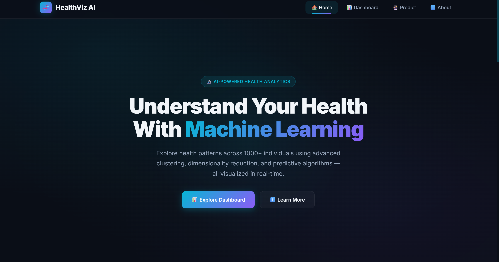
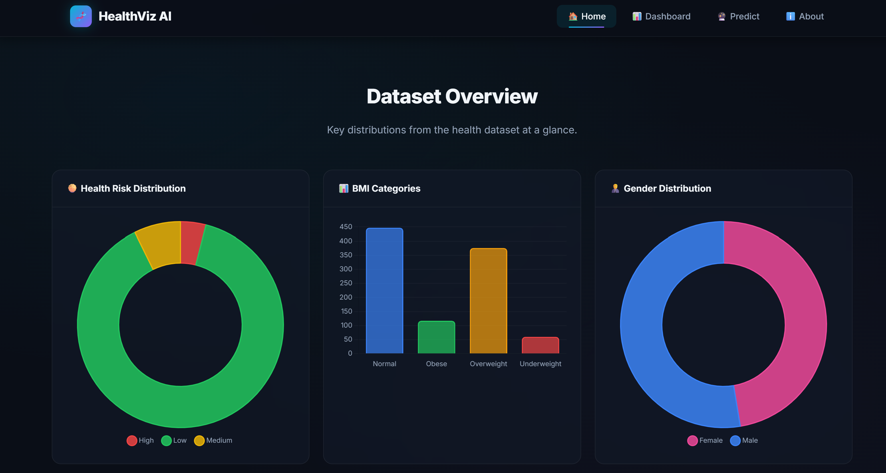

## Dashboard

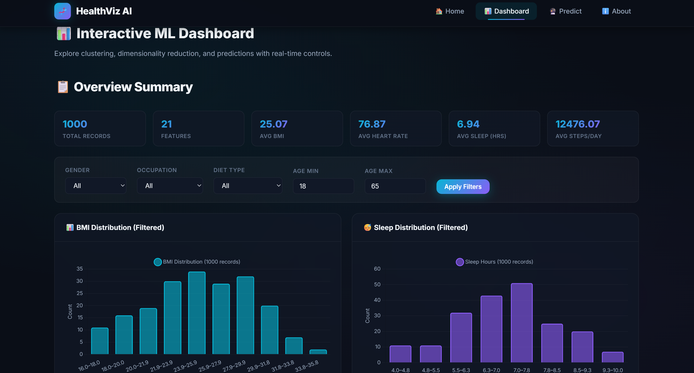

## Prediction

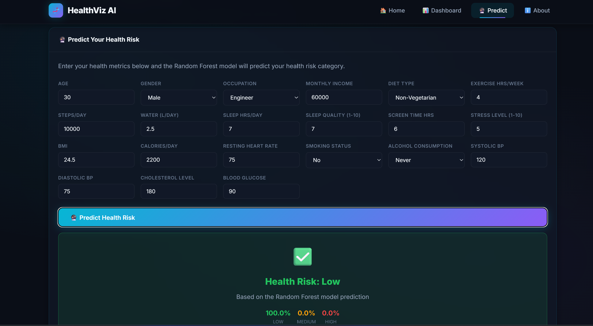


## K-Means

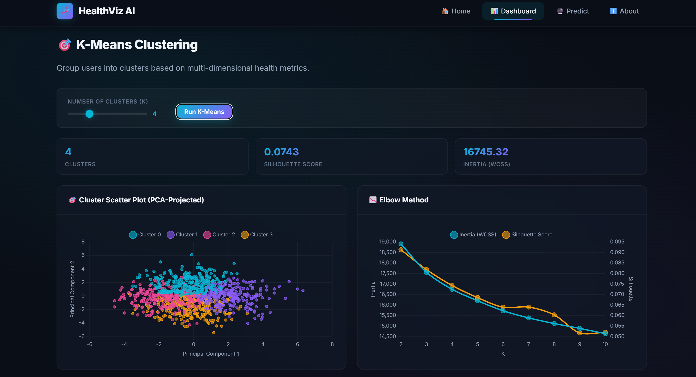
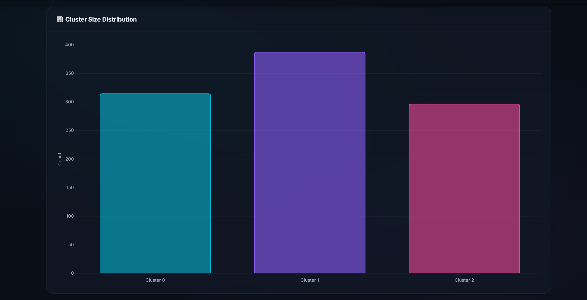

## PCA

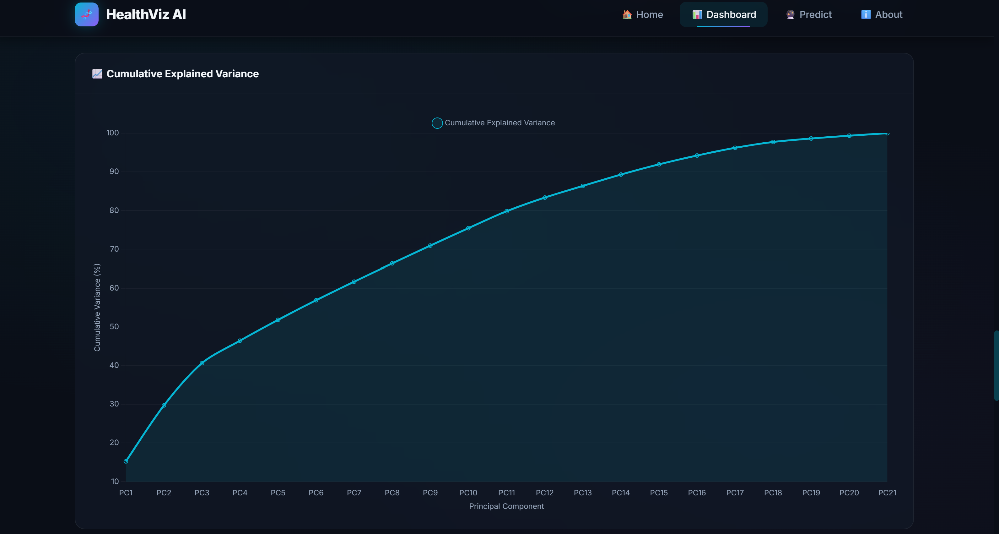
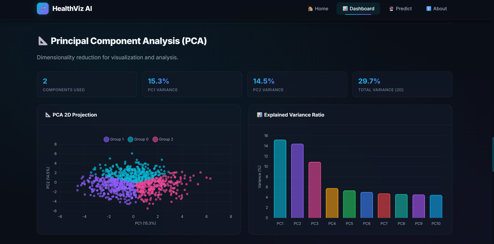

## Random Forest

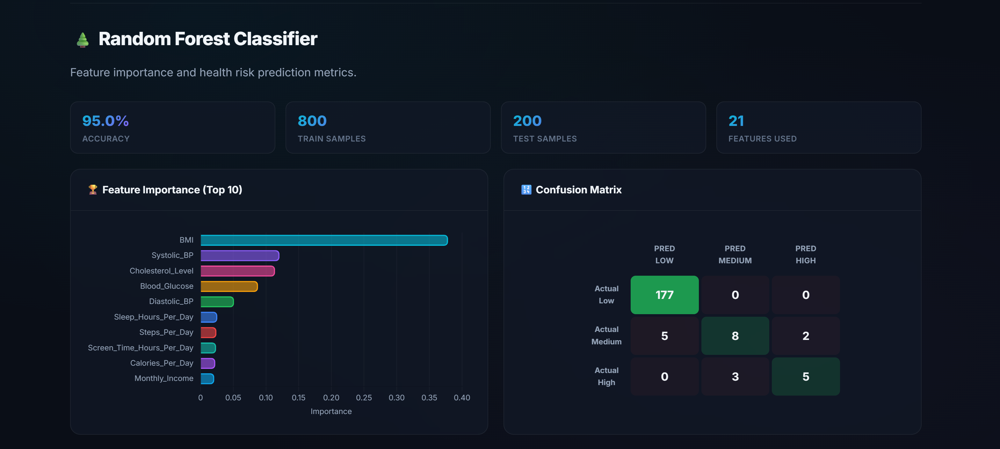
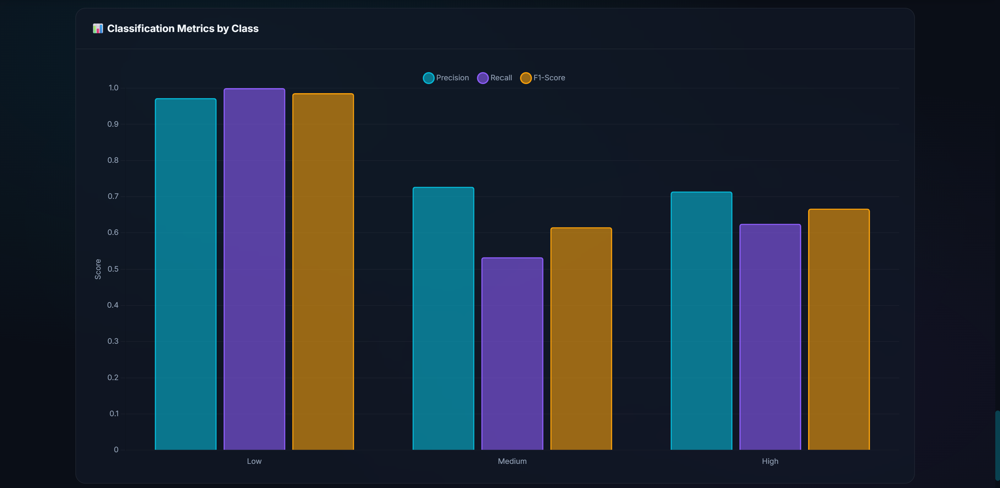

## DBSCAN

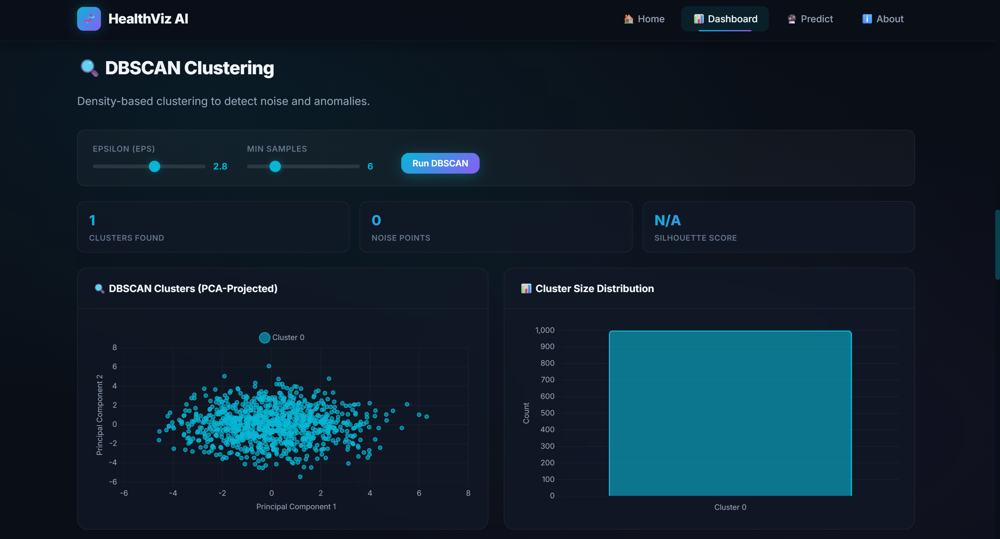


```

---

# 💡 Future Improvements

- Add XGBoost Classifier
- Add LightGBM
- Deep Learning Model
- Real-Time Health Monitoring
- User Login System
- Cloud Deployment
- Mobile Responsive Dashboard
- Personalized Health Recommendations

---

# 👨‍💻 Author

**Jerlin**

GitHub: https://github.com/Jerlinmartina

LinkedIn: https://linkedin.com/in/jerlinmartina

---

# ⭐ Support

If you found this project helpful, please consider giving it a ⭐ on GitHub.

---

# 📄 License

This project is licensed under the **MIT License**.
